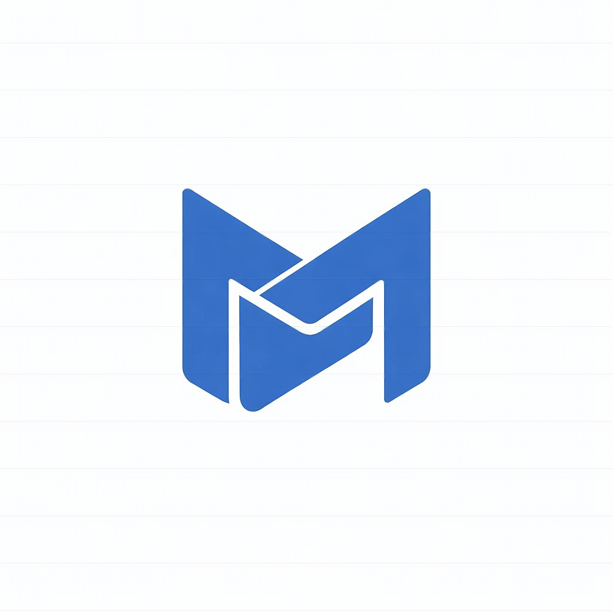

<p align="center">
  
</p>

<h1 align="center">MertNews</h1>

<p align="center">
  <strong>Apple-inspired modern news aggregator built with SvelteKit.</strong><br />
  Live RSS feeds · Real-time finance data · i18n (TR / EN) · Dark mode
</p>

<p align="center">
  
  
  
  
  
</p>

---

## English

### Overview

MertNews is a full-featured, Apple.com-inspired news portal that aggregates 40+ RSS feeds from trusted international and Turkish sources into a single, beautifully designed interface. Every pixel is crafted to match Apple's design language — from the full-bleed promo grid to the horizontal scroll carousel and frosted-glass navigation.

### Key Features

| Feature | Description |
|---|---|
| **Apple-style Promo Grid** | Edge-to-edge, zero-radius modules with large imagery and pill CTAs — identical to apple.com product tiles |
| **Horizontal Scroll Carousel** | Snap-scrolling story strip with keyboard navigation and fade edges |
| **Live Finance Dashboard** | Real-time CBRT forex rates, Binance/CoinGecko crypto, and PAXG gold spot prices |
| **Article Preview Modal** | Inline iframe preview with frosted toolbar — no page navigation needed |
| **Full i18n Support** | Complete Turkish and English translations with locale cookie persistence |
| **Dark Mode** | Automatic `prefers-color-scheme` with Apple-calibrated dark palette |
| **Mega Menu Navigation** | Full-width flyout panels with source filters, just like apple.com |
| **Smart Image Handling** | Extracts images from RSS `<media:content>`, `<enclosure>`, and HTML content with HEAD-request verification |
| **Search Overlay** | Full-screen search with fuzzy matching and quick links |
| **Currency Ticker** | Scrolling ticker bar with live forex and crypto data |
| **SEO & PWA Ready** | Web manifest, Apple Touch Icon, multi-size favicons, semantic HTML |

### Architecture

```
src/
├── app.css                  # Apple design system tokens
├── app.html                 # Shell with favicon/manifest setup
├── components/
│   ├── Navbar.svelte        # Global nav with mega menu panels
│   ├── Footer.svelte        # 4-column footer with logo
│   ├── Hero.svelte          # Full-viewport hero module
│   ├── NewsCard.svelte      # Dual-mode card (carousel / grid)
│   ├── AppleHorizontalScroll.svelte  # Snap-scroll carousel
│   ├── ArticleModal.svelte  # Iframe preview modal
│   ├── SearchOverlay.svelte # Full-screen search
│   ├── CurrencyTicker.svelte # Scrolling ticker
│   ├── CurrencyGrid.svelte  # Finance data grid
│   ├── AppleInfoPage.svelte # Static content layout
│   ├── ContactForm.svelte   # Contact form
│   └── SkeletonCard.svelte  # Loading placeholders
├── lib/
│   ├── i18n.js              # TR/EN translations store
│   ├── stores/modal.js      # Article modal state
│   └── server/
│       ├── rss.js           # RSS aggregation engine (40+ feeds)
│       └── translate.js     # Title translation pipeline
└── routes/
    ├── +page.svelte         # Homepage (hero + carousel + grid)
    ├── [category]/           # Dynamic category pages
    ├── finans/               # Live finance dashboard
    ├── spor/                 # Sports feed
    ├── kaynak/               # Source browser
    └── api/                  # Search & subscription endpoints
```

### Tech Stack

- **Framework:** SvelteKit (SSR + hydration)
- **Build:** Vite
- **RSS Parsing:** rss-parser
- **XML:** fast-xml-parser
- **Icons:** Lucide Svelte
- **Styling:** Vanilla CSS with Apple design tokens
- **Data:** Live RSS feeds, CBRT API, Binance API, CoinGecko API

### Getting Started

```bash
# Clone
git clone https://github.com/tahsinmert/MertNews.git
cd MertNews

# Install dependencies
npm install

# Development server
npm run dev

# Production build
npm run build

# Preview production build
npm run preview
```

### RSS Sources

MertNews aggregates content from **40+ trusted sources** across five categories:

- **World** — BBC, CNN, The Guardian, Al Jazeera, TRT World, DW, NPR, France 24, Euronews, and more
- **Turkey** — Hürriyet, Anadolu Ajansı, TRT Haber, Sabah, Milliyet, CNN Türk, NTV
- **Technology** — TechCrunch, The Verge, Ars Technica, Wired, Engadget, BBC Tech
- **Economy** — CNBC, BBC Business, The Guardian Business, Bloomberg HT, Hürriyet Ekonomi
- **Sports** — Aggregated from all active sources

---

## Türkçe

### Genel Bakış

MertNews, Apple.com tasarım dilinden ilham alan, 40'tan fazla güvenilir uluslararası ve Türk kaynağından RSS beslemelerini tek bir arayüzde toplayan modern bir haber portalıdır. Tam genişlikte promo ızgarası, yatay kaydırmalı haber şeridi ve buzlu cam efektli navigasyonuyla her piksel Apple'ın tasarım standartlarına uygun şekilde hazırlanmıştır.

### Temel Özellikler

| Özellik | Açıklama |
|---|---|
| **Apple Tarzı Promo Izgarası** | Kenardan kenara, köşesiz modüller — büyük görseller ve pill butonlarla apple.com ürün kutularının birebir taklidi |
| **Yatay Kaydırma Şeridi** | Snap-scroll destekli haber şeridi, klavye navigasyonu ve soluklaşan kenarlar |
| **Canlı Finans Paneli** | TCMB döviz kurları, Binance/CoinGecko kripto ve PAXG altın spot fiyatları |
| **Makale Önizleme Modalı** | Buzlu cam araç çubuğuyla iframe içi önizleme — sayfa değiştirmeye gerek yok |
| **Tam i18n Desteği** | Eksiksiz Türkçe ve İngilizce çeviriler, çerez ile dil tercihi saklama |
| **Karanlık Mod** | Otomatik `prefers-color-scheme` ile Apple kalibrasyonlu koyu palet |
| **Mega Menü Navigasyonu** | Kaynak filtreli, tam genişlikte açılır paneller |
| **Akıllı Görsel İşleme** | RSS `<media:content>`, `<enclosure>` ve HTML içeriğinden görsel çıkarma, HEAD isteğiyle doğrulama |
| **Arama Katmanı** | Tam ekran arama, bulanık eşleşme ve hızlı bağlantılar |
| **Döviz Ticker'ı** | Canlı döviz ve kripto verileriyle kayan bant |
| **SEO & PWA Hazır** | Web manifest, Apple Touch Icon, çoklu favicon boyutları, semantik HTML |

### Başlangıç

```bash
# Klonlama
git clone https://github.com/tahsinmert/MertNews.git
cd MertNews

# Bağımlılıkları yükleme
npm install

# Geliştirme sunucusu
npm run dev

# Üretim derlemesi
npm run build

# Üretim önizlemesi
npm run preview
```

### Haber Kaynakları

MertNews, beş kategori altında **40'tan fazla güvenilir kaynaktan** içerik toplar:

- **Dünya** — BBC, CNN, The Guardian, Al Jazeera, TRT World, DW, NPR, France 24, Euronews ve dahası
- **Türkiye** — Hürriyet, Anadolu Ajansı, TRT Haber, Sabah, Milliyet, CNN Türk, NTV
- **Teknoloji** — TechCrunch, The Verge, Ars Technica, Wired, Engadget, BBC Tech
- **Ekonomi** — CNBC, BBC Business, The Guardian Business, Bloomberg HT, Hürriyet Ekonomi
- **Spor** — Tüm aktif kaynaklardan derlenen akış

---

## License

This project is licensed under the [MIT License](LICENSE).

<p align="center">
  <sub>Designed & developed with precision by <a href="https://github.com/tahsinmert">tahsinmert</a></sub>
</p>
